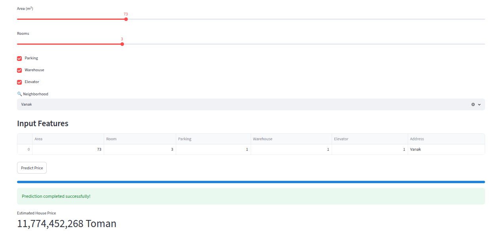

# Tehran-House-Price-Predictor

# House Price Prediction Web App
## Demo


A machine learning web application built with Streamlit that predicts house prices based on user inputs.

## Features

* Predict house prices using a trained machine learning model
* Simple and user-friendly interface
* Supports property features such as:

  * Area
  * Number of Rooms
  * Parking
  * Warehouse
  * Elevator
  * Address/Location
    
* Real-time prediction


for Downloading dataset :
```
#!/bin/bash
curl -L -o ~/Downloads/iran-house-price.zip\
  https://www.kaggle.com/api/v1/datasets/download/amirjdai/iran-house-price
```

## Technologies Used

* Python
* Streamlit
* Scikit-learn
* Pandas
* NumPy
* Joblib

## Project Structure

├── app.py
├── model.pkl
├── requirements.txt
└── README.md

## Installation

1. Clone the repository:

```bash
git clone https://github.com/mamadj0n/Tehran-House-Price-Predictor.git
cd Tehran-House-Price-Predictor
```

2. Create a virtual environment:

```bash
python -m venv venv
```

3. Activate the environment:

Linux/Mac:

```bash
source venv/bin/activate
```

Windows:

```bash
venv\Scripts\activate
```

4. Install dependencies:

```bash
pip install -r requirements.txt
```

## Run the Application

```bash
streamlit run app.py
```

## Model Input Features

| Feature   | Description                    |
| --------- | ------------------------------ |
| Area      | Property area in square meters |
| Room      | Number of rooms                |
| Parking   | Parking availability           |
| Warehouse | Warehouse availability         |
| Elevator  | Elevator availability          |
| Address   | Property location              |

## Output

The application predicts the estimated house price based on the provided information.

## Future Improvements

* Interactive maps
* Advanced feature engineering
* Model comparison dashboard
* Support for multiple machine learning models

## Author

Mohamad
